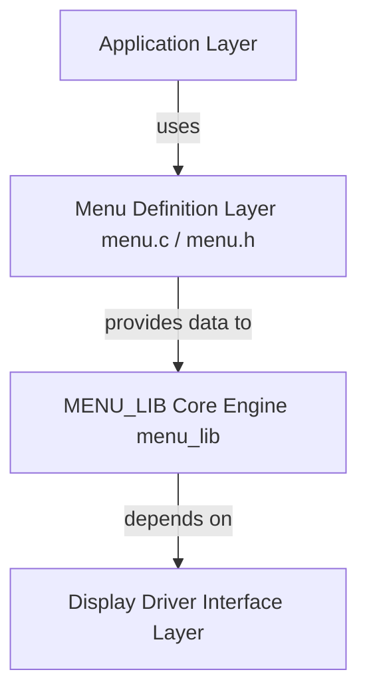
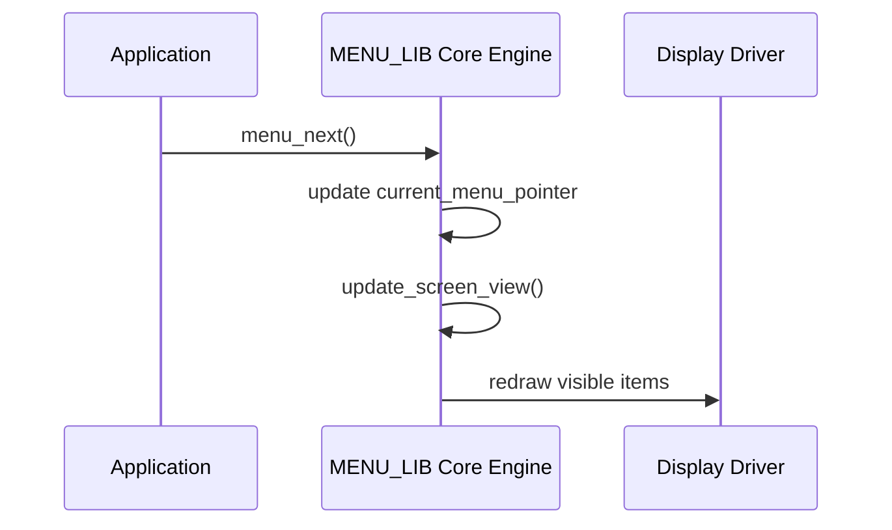
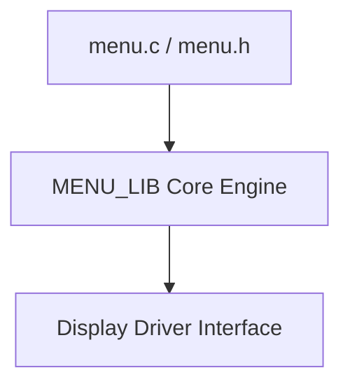
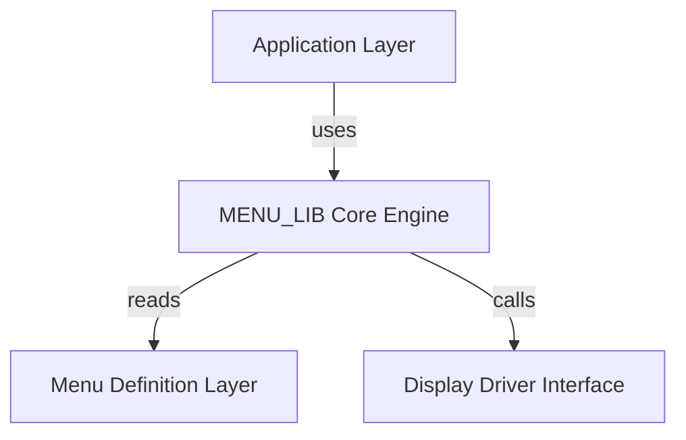
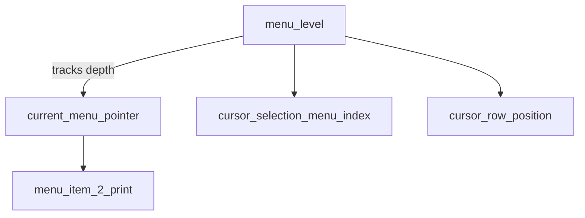
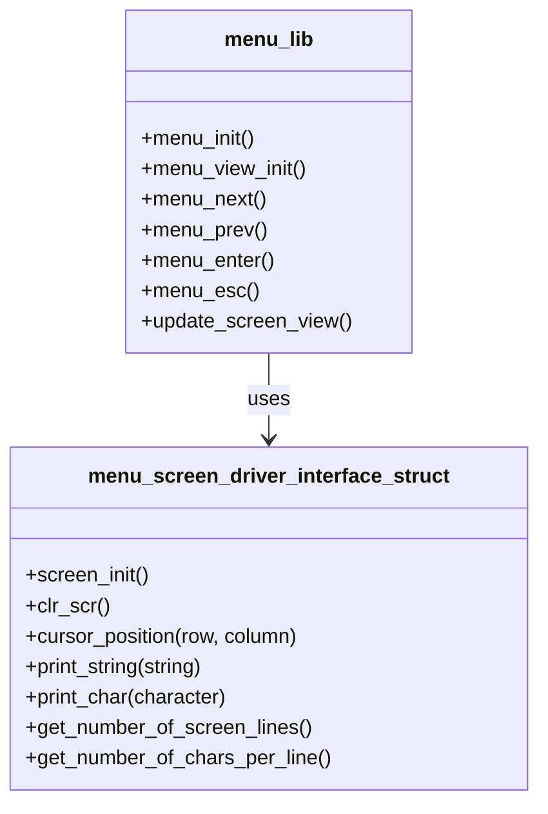
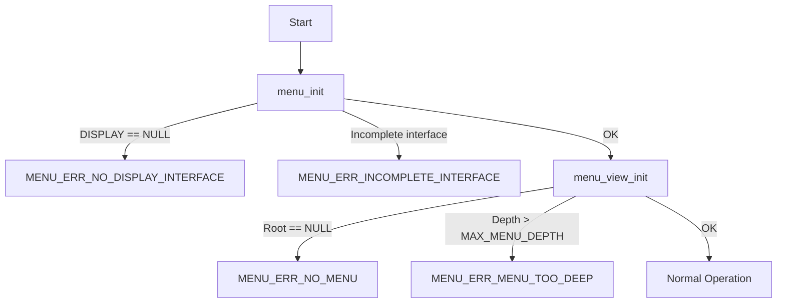

# 🧩 MENU_LIB — Architecture Overview

This document describes the **internal architecture** of the `MENU_LIB` library, its **layered structure**, **data model**, and how it integrates with **user-generated menu files** (`menu.c`, `menu.h`) and the **display driver interface**.

The **Menu Library (`MENU_LIB`)** provides a hierarchical, text-based menu system for embedded applications, separating **menu logic**, **display handling**, and **menu data structures** for portability across different display drivers (LCD, OLED, UART, etc.).

---

## 🏗️ Layered Architecture Overview

The library is designed with a **4-layer modular architecture**, separating:

1. **Application Layer** – user code and callbacks  
2. **Menu Definition Layer** – statically generated menu data (`menu.c`, `menu.h`)  
3. **Menu Engine Core** – logic, navigation, and rendering (`menu_lib`)  
4. **Display Driver Layer** – hardware abstraction (`menu_screen_driver_interface`)  

---

### 🔶 High-Level Dependency Diagram



---

## 🧱 Core Components

### 1. **menu_t Structure (Menu Model)**

Defined in `menu_lib_type.h`:

```c
typedef struct menu_t {
    const char *name;
    struct menu_t *next;
    struct menu_t *prev;
    struct menu_t *child;
    struct menu_t *parent;
    void (*callback)(void);
} menu_t;
```

* Forms the **tree of doubly linked lists** used by the engine.  
* Each node (menu item) can point to sibling items (`next`, `prev`), a submenu (`child`), or a parent (`parent`).  
* `callback` is optional and executed when the item is entered.  

---

### 2. **Core Logic Layer (`menu_lib.c`)**

Implements the main logic:

| Function                      | Purpose                                     |
| ----------------------------- | ------------------------------------------- |
| `menu_init()`                 | Initialize internal state and assign driver |
| `menu_view_init()`            | Set initial menu view and render root       |
| `menu_next()` / `menu_prev()` | Horizontal navigation                       |
| `menu_enter()` / `menu_esc()` | Vertical navigation or callback execution   |
| `update_screen_view()`        | Refresh display via driver                  |
| `get_current_menu_position()` | Retrieve pointer to the current menu item   |

This layer:
* Keeps track of the **current menu pointer** and navigation indices.  
* Ensures safe transitions (checks for `NULL` pointers).  
* Requests screen updates via the driver interface.  

#### Simplified Flow



---

### 3. **Display Driver Interface Layer**

Defined in `menu_screen_driver_interface.h`.

* Acts as a **bridge** between the logical menu engine and the actual display hardware.  
* User implements driver functions for their specific hardware.  

#### Example Connection

```c
menu_screen_driver_interface_struct display_driver = {
    .screen_init = lcd_init,
    .clr_scr = lcd_clear,
    .cursor_position = lcd_set_cursor,
    .print_string = lcd_print,
    .print_char = lcd_putc,
    .get_number_of_screen_lines = lcd_rows,
    .get_number_of_chars_per_line = lcd_cols
};

menu_init(&display_driver);
```

---

### 4. **Menu Definition Layer (Generated Code)**

Static menu structure is generated by **JS Menu Designer**.

* `menu.h` — external declarations and configuration constants (e.g. `MAX_MENU_DEPTH`)  
* `menu.c` — definitions of `menu_t` items and optional callbacks  

#### Mermaid Diagram



---

### 5. **Application Layer**

The user's code:

* Initializes the system and the driver  
* Calls `menu_init()` and `menu_view_init()`  
* Responds to hardware input (buttons, encoder, UART commands)  
* Implements user callbacks  

#### Example

```c
void callback_settings(void) {
    printf("Entering settings...\n");
}

int main(void) {
    menu_init(&display_driver);
    menu_view_init(&main_menu, on_exit, "Main Menu");

    while (1) {
        // Handle input and navigation
    }
}
```

---

### 6. **Callback Integration**

The library supports a top-level exit callback (`menu_exit_cb_t`), defined in `menu_lib.h`.  
It is invoked when the user exits the main menu via `menu_esc()` at the root level, allowing the application to restore context or perform cleanup.

---

## 🧭 Data Flow Diagram



---

## ⚙️ File Responsibility Summary

| File                               | Role                                | Owned by             |
| ---------------------------------- | ----------------------------------- | -------------------- |
| **menu_lib.h / .c**                | Core engine                         | Library              |
| **menu_lib_type.h**                | Data types (`menu_t`, `menu_status_t`) | Library            |
| **menu_screen_driver_interface.h** | Abstract screen interface           | Library              |
| **menu.h / menu.c**                | Static menu definitions & callbacks | Generated by JS tool |
| **main.c**                         | User application                    | User                 |
| **lcd_driver.c/h**                 | Hardware display driver             | User                 |

---

## 🧠 Global State Management



| Variable | Description |
|-----------|-------------|
| `menu_level` | Current depth in menu hierarchy. |
| `current_menu_pointer` | Pointer to currently selected menu item. |
| `menu_item_2_print` | Pointer used for iterating through visible items. |
| `cursor_selection_menu_index[]` | Stores cursor position per menu depth. |
| `cursor_row_position[]` | Screen row where cursor is drawn per level. |
| `menu_initialized` | Indicates whether the library was successfully initialized. |

---

## 🔗 Display Abstraction

The display driver abstraction enables the menu to run on any screen implementation that adheres to the `menu_screen_driver_interface_struct` interface.



---

## ⚠️ Error Handling Flow



---

## 🔐 Key Design Principles

* **Static Memory Model** — all menus defined at compile time; no dynamic allocation.  
* **Hardware Independence** — rendering separated via driver interface.  
* **Callback-Driven Logic** — menu items execute user-defined actions.  
* **Low Resource Usage** — suitable for embedded targets.  
* **Separation of Concerns** — menu logic, hardware, and application are independent layers.  

---

## 🧩 Summary

The architecture of `MENU_LIB` ensures:  
- Clear separation between logic, menu data, and hardware access.  
- Safe, static handling of menu structures.  
- Support for multiple hierarchical levels.  
- Portable and lightweight embedded integration.