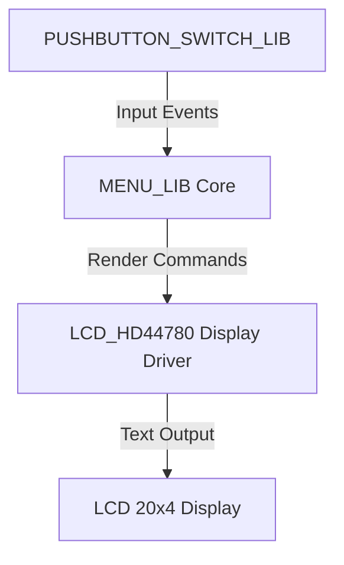

# 🚀 Getting Started with MENU_LIB

This guide demonstrates how to integrate **MENU_LIB** into a complete embedded application, using:  
- [**LCD_HD44780**](https://github.com/niwciu/LCD_HD44780) — the **display driver** responsible for text rendering, and  
- [**PUSHBUTTON_SWITCH_LIB**](https://github.com/niwciu/PUSHBUTTON_SWITCH_LIB.git) — the **user input interface** providing debounced button handling.

We will build a small hierarchical menu displayed on a **20x4 character LCD**, operated by four pushbuttons (**UP**, **DOWN**, **ENTER**, **ESC**).  
Step by step, you will learn how to connect all components — display, input, and menu logic — into a single functional embedded UI layer.

A ready-to-build reference example is available in the [`examples/`](../examples) directory.

For detailed hardware configuration, wiring, and library-specific setup, refer to the documentation of each library.

> ⚙️ **Assumptions:**  
> In this tutorial, we assume that both the **LCD_HD44780** and **PUSHBUTTON_SWITCH_LIB** libraries are  
> already correctly **configured, initialized, and verified to work independently** in your hardware environment.  
> The goal of this document is to demonstrate how to integrate **MENU_LIB** on top of those lower-level libraries  
> to create a complete menu system.  
>  
> For configuration guides, see:  
> - [LCD_HD44780 Documentation](https://niwciu.github.io/LCD_HD44780/)  
> - [PUSHBUTTON_SWITCH_LIB Documentation](https://niwciu.github.io/PUSHBUTTON_SWITCH_LIB/)  
>  
> For the specific hardware configuration used in the examples, refer to the  
> **[Examples Overview](examples.md)** page.

---

---

## 🧱 Project Structure Overview

The integration example uses three main layers:



The guide below is based on the example project structure shown below:

```
project_root/
├── hw/
│   └── Nucleo_STM32G071RB_LL/              # cube mx project with hw configuration
│   │   ├── Core/
│   │   │   ├── Inc/
│   │   │   ├── Src/
│   │   │   │   :
│   │   │   │   ├── main.c
│   │   │   │   ├── lcd_hd44780_GPIO_interface.c
│   │   │   │   ├── pushbutton_GPIO_interface.c
│   │   │   │   :
│   │   │   │   
│   │   │   └── Startup/ ..
│   │   ├── Drivers/ ..
│   │   :
│   │   └── CMakeLists.txt
├── lib/
│   ├── MENU_LIB/
│   │   ├── CMakeLists.txt
│   │   ├── menu_lib.c
│   │   ├── menu_lib.h
│   │   ├── menu_lib_type.h
│   │   └── menu_screen_driver_interface.h
│   ├── LCD_HD44780/                        # configured and integrated library
│   │   ├── CMakeLists.txt
│   │   ├── lcd_hd44780.c
│   │   ├── lcd_hd44780.h
│   │   ├── lcd_hd44780_GPIO_interface.h
│   │   ├── lcd_hd44780_config.h
│   │   └── lcd_hd44780_GPIO_interface.h
│   └── PUSHBUTTON_SWITCH_LIB/              # configured and integrated library
│       ├── CMakeLists.txt
│       ├── pushbutton.c
│       ├── pushbutton.h
│       └── pushbutton_GPIO_interface.h
├── src/
│   ├── UI\
│   │   ├── keypad.c
│   │   ├── keypad.h
│   │   ├── menu.c                          # ← to be created in Step x
│   │   ├── menu.h                          # ← to be created in Step x
│   │   ├── menu_screen_driver_interface.c  # ← to be created in Step 1
│   ├── main.c
│   ├── pushbutton_GPIO_interface.c
│   ├── pushbutton_GPIO_interface.c
│   ├── menu_screen_driver_interface.c   # ← to be created in Step 1
│   ├── menu_config.c                    # (menu structure)
│   └── menu_config.h
└── CMakeLists.txt / project configuration file
```

You can keep the libraries in any location in your project, but make sure they are **added to your project’s compilation process**, either through:

* `CMakeLists.txt`,
* `Makefile`, or
* IDE project settings (e.g., STM32CubeIDE or similar).

After creating new source files (like `menu_screen_driver_interface.c`), remember to include them in the build system configuration.

---

## 🚟️ Step 1 — Integrate the Display Driver

Assuming that **LCD_HD44780** is already added and configured in your as well as has defined it's driver we can start from creating ` menu_screen_driver_interface.c`

Include the driver headers as shown below and connect its functions to the `menu_screen_driver_interface_struct`. Then define the required accessor function `get_menu_display_driver_interface()`.

```c
#include "lcd_hd44780.h"
#include "lcd_hd44780_config.h"
#include "menu_screen_driver_interface.h"

// --- Callback declarations ---
static uint8_t get_screen_lines(void);
static uint8_t get_screen_columns(void);

// --- LCD driver interface definition ---
const struct menu_screen_driver_interface_struct display_driver = {
    .screen_init = lcd_init,
    .clr_scr = lcd_cls,
    .cursor_position = (void (*)(uint8_t, uint8_t))lcd_locate,
    .print_string = lcd_str,
    .print_char = lcd_char,
    .get_number_of_screen_lines = get_screen_lines,
    .get_number_of_chars_per_line = get_screen_columns
};

// --- Callback definitions ---
static uint8_t get_screen_lines(void)  { return LCD_Y; }
static uint8_t get_screen_columns(void){ return LCD_X; }

// --- Accessor function for MENU_LIB ---
const struct menu_screen_driver_interface_struct *get_menu_display_driver_interface(void)
{
    return &display_driver;
}
```

### 🧠 Explanation

* `LCD_X` and `LCD_Y` are compile-time macros defined in `lcd_hd44780_config.h` according to the selected LCD type.
* The `get_menu_display_driver_interface()` function provides a standardized way for **MENU_LIB** to access the display driver without modifying its internals.
* This ensures full hardware abstraction and allows you to replace the LCD driver easily in future projects.

That’s all for the display driver interface setup. Save and close this file — we’ll initialize everything later in a separate section, along with other modules.

---

## 🎛️ Step 2 — Integrate the Input Interface

Include the pushbutton library headers and configure four buttons.

```c
#include "pushbutton.h"

// Button objects
PUSHBUTTON_TypDef button_up;
PUSHBUTTON_TypDef button_down;
PUSHBUTTON_TypDef button_enter;
PUSHBUTTON_TypDef button_esc;
```

Register GPIO access callbacks and assign menu control functions:

```c
void on_up_pressed(void)     { menu_prev(); }
void on_down_pressed(void)   { menu_next(); }
void on_enter_pressed(void)  { menu_enter(); }
void on_esc_pressed(void)    { menu_esc(); }

void buttons_init(void)
{
    init_pushbutton(&button_up, REPETITION_OFF, TRIGGER_ON_PUSH, PB_get_driver_interface);
    init_pushbutton(&button_down, REPETITION_OFF, TRIGGER_ON_PUSH, PB_get_driver_interface);
    init_pushbutton(&button_enter, REPETITION_OFF, TRIGGER_ON_PUSH, PB_get_driver_interface);
    init_pushbutton(&button_esc, REPETITION_OFF, TRIGGER_ON_PUSH, PB_get_driver_interface);

    register_button_push_callback(&button_up, on_up_pressed);
    register_button_push_callback(&button_down, on_down_pressed);
    register_button_push_callback(&button_enter, on_enter_pressed);
    register_button_push_callback(&button_esc, on_esc_pressed);
}
```

In the main loop, continuously update the button states:
```c
check_pushbutton(&button_up);
check_pushbutton(&button_down);
check_pushbutton(&button_enter);
check_pushbutton(&button_esc);
```

---

## 🧩 Step 3 — Define the Menu Structure

Create simple static menu data in `menu.c` and `menu.h`.  
This can be done manually or generated using the [**Menu Generator Tool**](menu_generator.md).

Example:
```c
#include "menu_lib_type.h"

void cb_info(void);
void cb_settings(void);

menu_t settings = {"Settings", NULL, NULL, NULL, NULL, cb_settings};
menu_t info = {"Info", NULL, &settings, NULL, NULL, cb_info};
menu_t main_menu = {"Main Menu", &settings, NULL, NULL, NULL, NULL};
```

---

## ⚙️ Step 4 — Initialize and Run

In your main application file:

```c
#include "menu_lib.h"

void cb_info(void) {
    lcd_cls();
    lcd_str("Device info...");
}

void cb_settings(void) {
    lcd_cls();
    lcd_str("Adjust settings...");
}

int main(void)
{
    lcd_init();
    buttons_init();

    menu_init(&display_driver);
    menu_view_init(&main_menu, NULL, "Main Menu");

    while (1) {
        check_pushbutton(&button_up);
        check_pushbutton(&button_down);
        check_pushbutton(&button_enter);
        check_pushbutton(&button_esc);
    }
}
```

---

## 🧪 Step 5 — Build and Run

Build the project using your preferred toolchain or CMake target.

```bash
cmake -S./ -B out -G "Unix Makefiles"
cd out
make all
```

Upload the firmware to your target MCU and power up.  
You should see your **Main Menu** displayed on the LCD, navigable via the four buttons.

---

## 🧩 Notes and References

- This setup demonstrates the **integration layer** — not the low-level configuration.  
- Each helper library handles its own hardware layer (GPIO, LCD timing, etc.).  
- To understand how each library works internally, visit their documentation:

  - [LCD_HD44780 Documentation](https://niwciu.github.io/LCD_HD44780/)
  - [PUSHBUTTON_SWITCH_LIB Documentation](https://niwciu.github.io/PUSHBUTTON_SWITCH_LIB/)
  - [MENU_LIB Architecture Overview](architecture.md)

---

© 2025 Niwciu — MENU_LIB  
*Example integration guide for a fully modular embedded menu system.*