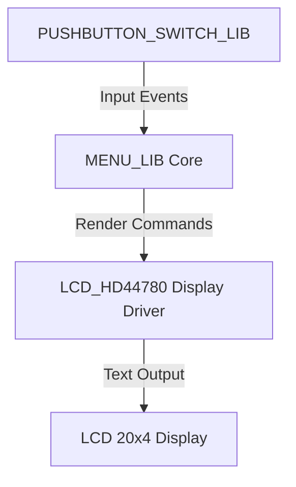
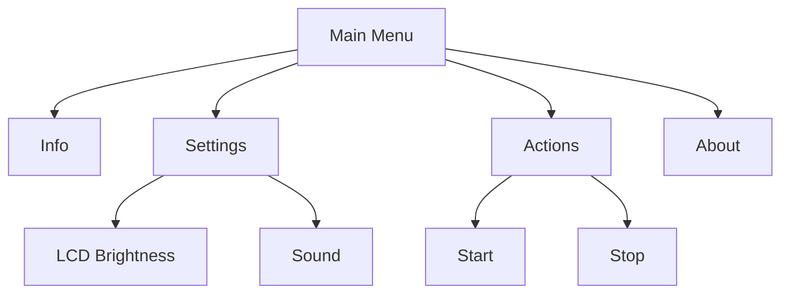

# 🚀 Getting Started with MENU_LIB

This guide demonstrates how to integrate **MENU_LIB** into a complete embedded application, using:

* [**LCD_HD44780**](https://github.com/niwciu/LCD_HD44780) — the **display driver** responsible for text rendering, and
* [**PUSHBUTTON_SWITCH_LIB**](https://github.com/niwciu/PUSHBUTTON_SWITCH_LIB.git) — the **user input interface** providing debounced button handling.

We will build a small hierarchical menu displayed on a **20×4 character LCD**, operated by four pushbuttons (**UP**, **DOWN**, **ENTER**, **ESC**). Step by step, you’ll connect display, input, and menu logic into a single functional embedded UI layer.

A ready-to-build reference example is available in the [`examples/`](../examples) directory.

For detailed hardware configuration, wiring, and library-specific setup, refer to the documentation of each library.

> ⚙️ **Assumptions**
> In this tutorial, both **LCD_HD44780** and **PUSHBUTTON_SWITCH_LIB** are already correctly **configured, initialized, and verified to work independently** on your hardware.
> The goal is to show how to integrate **MENU_LIB** on top of these lower-level libraries to create a complete menu system.
>
> Configuration guides:
> • [LCD_HD44780 Documentation](https://niwciu.github.io/LCD_HD44780/)
> • [PUSHBUTTON_SWITCH_LIB Documentation](https://niwciu.github.io/PUSHBUTTON_SWITCH_LIB/)
>
> For hardware used in the examples, see **[Examples Overview](examples.md)**.

---

## 🧱 Project Structure Overview

The integration uses three main layers:



The guide below is based on this example project structure:

```
getting_started_example_1/
├── hw/
│   └── Nucleo_STM32G071RB_LL/              # CubeMX project with HW configuration
│       ├── Core/
│       │   ├── Inc/
│       │   ├── Src/
│       │   │   ├── main.c
│       │   │   ├── lcd_hd44780_GPIO_interface.c
│       │   │   ├── pushbutton_GPIO_interface.c
│       │   └── Startup/..
│       ├── Drivers/..
│       └── CMakeLists.txt
├── lib/
│   ├── MENU_LIB/
│   │   └── CMakeLists.txt                  
│   ├── LCD_HD44780/                        # Configured and integrated library
│   │   ├── CMakeLists.txt
│   │   ├── lcd_hd44780.c
│   │   ├── lcd_hd44780.h
│   │   ├── lcd_hd44780_config.h
│   │   └── lcd_hd44780_GPIO_interface.h
│   └── PUSHBUTTON_SWITCH_LIB/              # Configured and integrated library
│       ├── CMakeLists.txt
│       ├── pushbutton.c
│       ├── pushbutton.h
│       └── pushbutton_GPIO_interface.h
└── src/
    ├── ui/
    │   ├── keypad.c                        # ← created in Step 2
    │   ├── keypad.h                        # ← created in Step 2
    │   ├── menu.c                          # ← created in Step 3
    │   ├── menu.h                          # ← created in Step 3
    │   └── menu_screen_driver_interface.c  # ← created in Step 1
    └── main_app.c
```

You may keep libraries anywhere in your tree, but make sure they are **added to the build**, either via:

* `CMakeLists.txt`,
* `Makefile`, or
* IDE settings (e.g., STM32CubeIDE).

After creating new source files (e.g., `menu_screen_driver_interface.c`), add them to the build configuration.

---

## 🚟️ Step 1 — Integrate the Display Driver

Assuming **LCD_HD44780** is added and configured (including its GPIO driver), create:

> `src/UI/menu_screen_driver_interface.c`

Include driver headers and connect them to `menu_screen_driver_interface_struct`. Implement the accessor `get_menu_display_driver_interface()`.

```c
#include "lcd_hd44780.h"
#include "lcd_hd44780_config.h"
#include "menu_screen_driver_interface.h"

// --- Callback declarations ---
static uint8_t get_screen_lines(void);
static uint8_t get_screen_columns(void);

// --- LCD driver interface definition ---
const struct menu_screen_driver_interface_struct display_driver = {
    .screen_init = lcd_init,
    .clr_scr = lcd_cls,
    .cursor_position = (void (*)(uint8_t, uint8_t))lcd_locate,
    .print_string = lcd_str,
    .print_char = lcd_char,
    .get_number_of_screen_lines = get_screen_lines,
    .get_number_of_chars_per_line = get_screen_columns
};

// --- Callback definitions ---
static uint8_t get_screen_lines(void)  { return LCD_Y; }
static uint8_t get_screen_columns(void){ return LCD_X; }

// --- Accessor function for MENU_LIB ---
const struct menu_screen_driver_interface_struct *get_menu_display_driver_interface(void)
{
    return &display_driver;
}
```

### 🧠 Explanation

* `LCD_X` and `LCD_Y` come from `lcd_hd44780_config.h` based on the selected LCD type.
* `get_menu_display_driver_interface()` gives **MENU_LIB** a stable way to access the display driver.
* This keeps hardware abstraction clean and lets you change the LCD driver later without touching menu logic.

That’s it for the display driver interface. Save and close — other modules will be initialized later.

---

## 🎛️ Step 2 — Create the Keypad Layer (UI)

Create a thin UI layer that maps **PUSHBUTTON_SWITCH_LIB** events to **MENU_LIB** navigation.

Add:

> `src/UI/keypad.h` and `src/UI/keypad.c`

### `keypad.h`

```c
#ifndef UI_KEYPAD_H_
#define UI_KEYPAD_H_

#ifdef __cplusplus
extern "C" {
#endif

void keypad_init(void);       // create buttons, register default (app) callbacks
void keypad_process(void);    // poll buttons; call periodically in main loop
void set_UI_main_app_scr(void); // draw default app screen (label/info)

#ifdef __cplusplus
}
#endif
#endif /* UI_KEYPAD_H_ */
```

### `keypad.c`

```c
#include "keypad.h"
#include "pushbutton.h"
#include "menu_lib.h"
#include "lcd_hd44780.h"
#include "lcd_hd44780_config.h"
#include "UI/menu.h"  // generated in Step 3

// Four navigation buttons
static PUSHBUTTON_TypDef btn_up;
static PUSHBUTTON_TypDef btn_down;
static PUSHBUTTON_TypDef btn_enter;
static PUSHBUTTON_TypDef btn_esc;

// Forward declarations
static void on_menu_enter(void);
static void on_menu_exit(void);
static void keypad_bind_menu_controls(void);
static void keypad_bind_main_app_controls(void);

void keypad_init(void)
{
    // All buttons: trigger on push, no repetition
    init_pushbutton(&btn_up,    REPETITION_OFF, TRIGGER_ON_PUSH, PB_get_driver_interface);
    init_pushbutton(&btn_down,  REPETITION_OFF, TRIGGER_ON_PUSH, PB_get_driver_interface);
    init_pushbutton(&btn_enter, REPETITION_OFF, TRIGGER_ON_PUSH, PB_get_driver_interface);
    init_pushbutton(&btn_esc,   REPETITION_OFF, TRIGGER_ON_PUSH, PB_get_driver_interface);

    keypad_bind_main_app_controls();
}

void keypad_process(void)
{
    // Poll debounced state machines; call from main loop
    check_pushbutton(&btn_up);
    check_pushbutton(&btn_down);
    check_pushbutton(&btn_enter);
    check_pushbutton(&btn_esc);
}

void set_UI_main_app_scr(void)
{
    lcd_buf_locate(LINE_2, C6);
    lcd_buf_str("Example  1");
    lcd_buf_locate(LINE_3, C4);
    lcd_buf_str("default mode");
}

static void on_menu_enter(void)
{
    // Start menu view at top-level; default header (NULL)
    // Root pointer is the first top-level item (menu_1) from the generator
    menu_view_init(&menu_1, on_menu_exit, NULL);
    keypad_bind_menu_controls();
}

static void on_menu_exit(void)
{
    lcd_cls();
    keypad_bind_main_app_controls();
    set_UI_main_app_scr();
}

static void keypad_bind_menu_controls(void)
{
    // UP -> previous item, DOWN -> next item
    register_button_push_callback(&btn_up,    menu_prev);
    register_button_push_callback(&btn_down,  menu_next);
    register_button_push_callback(&btn_enter, menu_enter);
    register_button_push_callback(&btn_esc,   menu_esc);
}

static void keypad_bind_main_app_controls(void)
{
    // Main app mode: only ENTER enters the menu
    register_button_push_callback(&btn_up,    NULL);
    register_button_push_callback(&btn_down,  NULL);
    register_button_push_callback(&btn_enter, on_menu_enter);
    register_button_push_callback(&btn_esc,   NULL);
}
```

**Notes**

* This assumes `pushbutton_GPIO_interface.c` provides `PB_get_driver_interface()`.
* Add `keypad.c` to your build (CMake/Makefile/IDE).

---

## 🧩 Step 3 — Define the Menu (via Generator)

Create the menu data (`menu.h` / `menu.c`) using the **Menu Generator Tool**:

* 🔧 Live app: [https://niwciu.github.io/LCD_MENU_GENERATOR_APP/](https://niwciu.github.io/LCD_MENU_GENERATOR_APP/)
* 📖 How-to: **[docs/menu_generator.md](menu_generator.md)**

### Proposed Example Menu (for 20×4 LCD)



**Notes**

* `Info` / `About` can be leaf items with callbacks.
* `Settings` / `Actions` are submenus; leaves (e.g., *LCD Brightness*, *Sound*, *Start*, *Stop*) may trigger callbacks.

### Generator Output — Example Files

Place the generated files under `src/UI/`.

#### `src/UI/menu.h`

```c
/**
 * @file menu.h
 * @author LCD menu code generator
 * @brief Generated menu declarations
 * @date 2025-11-02
 */
#ifndef _MENU_H_
#define _MENU_H_

#ifdef __cplusplus
extern "C" {
#endif

#include "menu_lib_type.h"

#define MAX_MENU_DEPTH 2

extern menu_t menu_1;
extern menu_t menu_2;
  extern menu_t menu_2_1;
  extern menu_t menu_2_2;
extern menu_t menu_3;
  extern menu_t menu_3_1;
  extern menu_t menu_3_2;
extern menu_t menu_4;

#ifdef __cplusplus
}
#endif
#endif /* _MENU_H_ */
```

#### `src/UI/menu.c`

```c
/**
 * @file menu.c
 * @author LCD menu code generator
 * @brief Generated menu definitions
 * @date 2025-11-02
 */
#include "menu.h"
#include <stddef.h>

static void info_cb(void);
static void lcd_brightness_cb(void);
static void sound_cb(void);
static void start_cb(void);
static void stop_cb(void);
static void about_cb(void);

menu_t menu_1   = { "Info",          &menu_2,   NULL,       NULL,      NULL,    info_cb };
menu_t menu_2   = { "Settings",      &menu_3,   &menu_1,    &menu_2_1, NULL,    NULL    };
menu_t menu_2_1 = { "LCD Brightness",&menu_2_2, NULL,       NULL,      &menu_2, lcd_brightness_cb };
menu_t menu_2_2 = { "Sound",         NULL,      &menu_2_1,  NULL,      &menu_2, sound_cb };
menu_t menu_3   = { "Action",        &menu_4,   &menu_2,    &menu_3_1, NULL,    NULL    };
menu_t menu_3_1 = { "Start",         &menu_3_2, NULL,       NULL,      &menu_3, start_cb };
menu_t menu_3_2 = { "Stop",          NULL,      &menu_3_1,  NULL,      &menu_3, stop_cb };
menu_t menu_4   = { "About",         NULL,      &menu_3,    NULL,      NULL,    about_cb };

static void info_cb(void)           { /* TODO: implement */ }
static void lcd_brightness_cb(void) { /* TODO: implement */ }
static void sound_cb(void)          { /* TODO: implement */ }
static void start_cb(void)          { /* TODO: implement */ }
static void stop_cb(void)           { /* TODO: implement */ }
static void about_cb(void)          { /* TODO: implement */ }
```

---

## 🧷 Step 4 — Integrate all components in main app

Create (or update) your application entry file to initialize the UI. In this basic example, the app starts in **app mode** (outside the menu); pressing **ENTER** enters the menu. If the LCD library uses buffering, call `lcd_update()` periodically.

> File: `src/main.c`

```c
#include "menu_lib.h"
#include "menu.h"          // generated in Step 3
#include "keypad.h"        // created in Step 2
#include "lcd_hd44780.h"      // for lcd_update() when buffering is ON
#include "lcd_hd44780_config.h"

int main(void)
{
    // Initialize MENU_LIB (fetches display interface and validates it)
    menu_init();

    // Initialize keypad/UI (ENTER enters the menu)
    keypad_init();

    // Print main app label
    set_UI_main_app_scr();

    // --- Main loop ---
    for (;;)
    {
        // Process debounced buttons; drives MENU_LIB when in menu mode
        keypad_process();

        // Keep the display refreshed when buffering is enabled
        lcd_update();
    }
}
```

> Notes
> • This example focuses on entering the menu, navigation, and dummy callbacks; real actions depend on your app’s architecture.
> • **MENU_LIB** updates the visible content in response to `menu_prev`, `menu_next`, `menu_enter`, `menu_esc`.
> • LCD init is provided through the display interface and used by **MENU_LIB**; no explicit LCD init here.

---

## 🧩 Step 5 — Implement Dummy Callbacks (Pattern)

A **minimal, safe pattern** for handling callbacks:

1. **Unbind menu navigation** from the keypad.
2. **Bind screen-specific handlers** (UP/DOWN/ENTER/ESC).
3. On exit, **restore menu navigation** and **refresh** the menu view using `update_screen_view()` (do **not** re-initialize with `menu_view_init()`).

### 5.1 Extend keypad API for runtime (re)binding

> `src/UI/keypad.h`

```c
#ifndef UI_KEYPAD_H_
#define UI_KEYPAD_H_

#ifdef __cplusplus
extern "C" {
#endif

void keypad_init(void);
void keypad_process(void);
void set_UI_main_app_scr(void);

// Bind MENU_LIB navigation to keypad (used when showing menus)
void keypad_bind_menu_controls(void);

// Bind custom handlers for a feature screen (NULL to ignore a key)
void keypad_bind_screen_handlers(void (*on_up)(void),
                                 void (*on_down)(void),
                                 void (*on_enter)(void),
                                 void (*on_esc)(void));

#ifdef __cplusplus
}
#endif
#endif /* UI_KEYPAD_H_ */
```

> `src/UI/keypad.c` (add implementations)

```c
#include "keypad.h"
#include "pushbutton.h"
#include "menu_lib.h"

static PUSHBUTTON_TypDef btn_up, btn_down, btn_enter, btn_esc;

void keypad_bind_menu_controls(void)
{
    register_button_push_callback(&btn_up,    menu_prev);
    register_button_push_callback(&btn_down,  menu_next);
    register_button_push_callback(&btn_enter, menu_enter);
    register_button_push_callback(&btn_esc,   menu_esc);
}

void keypad_bind_screen_handlers(void (*on_up)(void),
                                 void (*on_down)(void),
                                 void (*on_enter)(void),
                                 void (*on_esc)(void))
{
    register_button_push_callback(&btn_up,    on_up);
    register_button_push_callback(&btn_down,  on_down);
    register_button_push_callback(&btn_enter, on_enter);
    register_button_push_callback(&btn_esc,   on_esc);
}
```

### 5.2 Example callbacks in `menu.c`

Implement two callbacks using the binding helpers.

```c
#include "lcd_hd44780.h"
#include "lcd_hd44780_config.h"
#include "UI/keypad.h"
#include "menu_lib.h"

static void info_cb(void)
{
    // Unbind menu keys; only ESC goes back to the menu
    keypad_bind_screen_handlers(NULL, NULL, NULL, /* ESC: */ NULL);

    lcd_cls();
    lcd_str("Device info:\n");
    lcd_str("FW 1.0.0\n");
    lcd_str("Build: demo\n");
    lcd_str("<ESC> back");

    // ESC handler restores menu controls and refreshes menu view
    keypad_bind_screen_handlers(NULL, NULL, NULL, [](){
        keypad_bind_menu_controls();
        update_screen_view();
    });
}

static uint8_t brightness = 5; // demo state 0..10
static void br_up(void)   { if (brightness < 10) brightness++; }
static void br_down(void) { if (brightness > 0)  brightness--; }
static void br_apply(void) { /* TODO: apply to real backlight driver */ }
static void br_exit(void)
{
    keypad_bind_menu_controls();
    update_screen_view(); // refresh where user left off
}

static void lcd_brightness_cb(void)
{
    keypad_bind_screen_handlers(br_up, br_down, br_apply, br_exit);

    lcd_cls();
    lcd_str("LCD Brightness\n");

    // Simple bar visualization (20 chars wide)
    char line[21];
    for (uint8_t i = 0; i < 20; ++i) line[i] = (i < brightness) ? '#' : '-';
    line[20] = '\0';
    lcd_str(line);
    lcd_str("\nUP/DOWN set\nENTER apply, ESC back");
}
```

**Why `update_screen_view()` for exit?**
It **refreshes** the menu at the previous position. Re-initializing with `menu_view_init()` would reset position/history.

> Tip: For more advanced screens, re-draw after each key press and/or use LCD buffering (`lcd_buf_*`, `lcd_update()`).

---

## 🧱 Step 6 — Organizing Menu Actions (Wrappers & File Layout)

To keep generator output clean, separate **menu action logic** from generated `menu.c`/`menu.h` via **thin wrappers**.

**Pattern A — Single module for all actions (recommended start)**
Files: `src/UI/menu_actions.h`, `src/UI/menu_actions.c`
Generator stubs call functions declared in `menu_actions.h`.

**Pattern B — One file per feature (bigger projects)**
Folder: `src/UI/actions/` with `action_*.c`. A single umbrella `menu_actions.h` re-exports entry points.

> Start with **Pattern A**; refactor to **Pattern B** as features grow.

**`src/UI/menu_actions.h`**

```c
#ifndef UI_MENU_ACTIONS_H_
#define UI_MENU_ACTIONS_H_
#ifdef __cplusplus
extern "C" {
#endif

void act_info(void);
void act_lcd_brightness(void);
void act_sound(void);
void act_start(void);
void act_stop(void);
void act_about(void);

#ifdef __cplusplus
}
#endif
#endif /* UI_MENU_ACTIONS_H_ */
```

**`src/UI/menu_actions.c`** (skeleton)

```c
#include "menu_actions.h"
#include "UI/keypad.h"
#include "lcd_hd44780.h"

void act_info(void)  { lcd_cls(); lcd_str("Device info..."); }
void act_about(void) { lcd_cls(); lcd_str("About MENU_LIB"); }

void act_lcd_brightness(void) { /* enter brightness UI; bind keys; draw; exit via ESC */ }
void act_sound(void)          { /* enter sound UI */ }
void act_start(void)          { /* start action */ }
void act_stop(void)           { /* stop action */ }
```

**Wrap generator stubs in `menu.c`:**

```c
#include "menu_actions.h"

static void info_cb(void)           { act_info(); }
static void lcd_brightness_cb(void) { act_lcd_brightness(); }
static void sound_cb(void)          { act_sound(); }
static void start_cb(void)          { act_start(); }
static void stop_cb(void)           { act_stop(); }
static void about_cb(void)          { act_about(); }
```

Add to build:

```
src/UI/menu_actions.c
src/UI/menu_actions.h
```

---

## 🧱 Step 7 — Build & Run

Below are minimal build instructions and first-run expectations.

### ✅ Ensure files are in the build

For the example project, all sources are listed in the main `CMakeLists.txt`.

> Ensure **LCD_HD44780** and **PUSHBUTTON_SWITCH_LIB** (and their GPIO interfaces) are compiled with your app.
> If they are separate libraries, link them via `target_link_libraries(app ...)`.

### 🛠️ Build commands

Open a terminal in the example’s main folder (where the main `CMakeLists.txt` is stored):

=== **Makefiles**

```bash
cmake -S . -B out -G "Unix Makefiles"
cd out
make all
```

=== **Ninja**

```bash
cmake -S . -B out -G "Ninja"
cd out
ninja -V
```

### ⏫ Flash & run

Flash the binary using your usual tool (ST-Link, OpenOCD, IDE).
If you have **STM32_Programmer_CLI**, you can use predefined targets:

```bash
make flash     # or: ninja flash
```

On reset you should see:

* Screen with label **“Example 1 default mode”**.
* Press **ENTER** → menu opens with header and first page.
* **UP/DOWN** navigate siblings, **ENTER** enters a submenu / triggers a callback, **ESC** goes back.
* Pressing **ESC** at top-level menu exits to the default screen (**“Example 1 default mode”**).

---

## 🧯 Troubleshooting & Tips

**Blank screen**

* Check LCD contrast & power.
* Verify `lcd_hd44780_GPIO_interface.c` pin mapping.
* Ensure `menu_screen_driver_interface.c` is compiled and `menu_init()` is called.
* Confirm correct LCD type in `lcd_hd44780_config.h` (e.g., `#define LCD_TYPE 2004`).
* If buffering is enabled, call `lcd_update()` periodically (~ every 40 ms is a reasonable starting point, e.g., from a timer/RTOS task).
  For a quick sanity check, call:

  ```c
  lcd_init();
  lcd_str("Hello");
  ```

  during init to verify basic output.

**Menu does not react to buttons**

* Ensure `keypad_init()` is called and `keypad_process()` runs in the main loop.
* Confirm `PB_get_driver_interface()` is implemented and passed to `init_pushbutton(...)`.
* Check `TRIGGER_ON_PUSH` and that callbacks are registered (menu mode vs app mode).

**Wrong text wrapping/truncation**

* Keep item labels ≤ `LCD_X - 1` characters.
* Prefer short names; use submenus for longer descriptions.

**Error codes**

* `MENU_ERR_MENU_TOO_DEEP` → reduce nesting or increase `MAX_MENU_DEPTH` in generated `menu.h`. The generator sets this automatically; manual edits may desync it.
* `MENU_ERR_NO_DISPLAY_INTERFACE` / `MENU_ERR_INCOMPLETE_INTERFACE` → ensure **no NULLs** in the display driver struct.

**Callbacks behavior**

* Leaf item callback runs on **ENTER** when the item has **no child**.
* Use the wrapper pattern (Step 6) to swap keypad roles during feature handling and restore them on exit with `update_screen_view()`.

---

## ➡️ Where to go next

* **Examples** — richer setups and hardware configs: `examples/` and **Examples Overview**.
* **Menu Generator** — iterate quickly on structure: **docs/menu_generator.md**.
* **API Reference (MD)** — quick lookup of public types & calls: **docs/api_reference.md**.
* **Architecture** — deeper understanding of layers: **docs/architecture.md**.
