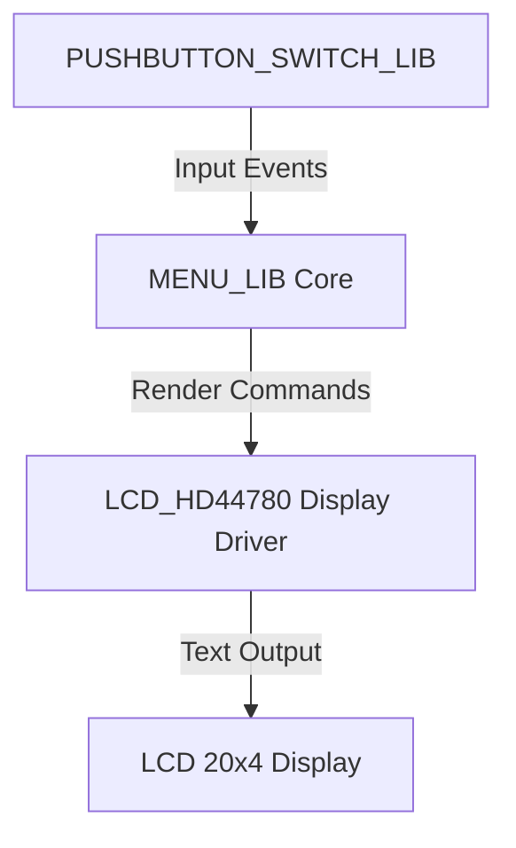
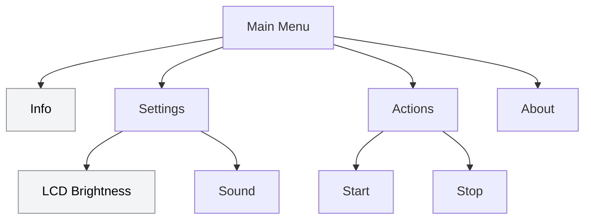

# 🚀 Getting Started with MENU_LIB

This guide demonstrates how to integrate **MENU_LIB** into a complete embedded application, using:

* [**LCD_HD44780**](https://github.com/niwciu/LCD_HD44780) — the **display driver** responsible for text rendering, and
* [**PUSHBUTTON_SWITCH_LIB**](https://github.com/niwciu/PUSHBUTTON_SWITCH_LIB.git) — the **user input interface** providing debounced button handling.

We will build a small hierarchical menu displayed on a **20×4 character LCD**, operated by four pushbuttons (**UP**, **DOWN**, **ENTER**, **ESC**). Step by step, you’ll connect display, input, and menu logic into a single functional embedded UI layer.

A ready-to-build reference example is available in the [`examples/`](../examples) directory.

For detailed hardware configuration, wiring, and library-specific setup, refer to the documentation of each library.

> ❗️⚠️ **Assumptions** ⚠️❗️
>
> In this tutorial, both **LCD_HD44780** and **PUSHBUTTON_SWITCH_LIB** are already correctly **configured, initialized, and verified to work independently** on your hardware.
> The goal is to show how to integrate **MENU_LIB** on top of these lower-level libraries to create a complete menu system.
> 
> In case if you are not familier with **LCD_HD44780** and **PUSHBUTTON_SWITCH_LIB** start from running those library first.
> Libraries home pages:
> * [LCD_HD44780 Documentation](https://niwciu.github.io/LCD_HD44780/)
> * [PUSHBUTTON_SWITCH_LIB Documentation](https://niwciu.github.io/PUSHBUTTON_SWITCH_LIB/)
>
> For hardware used in the examples, see **[Examples Overview](examples.md)**.

---

## 🧱 Project Structure Overview

The integration uses three main layers:



The guide below is based on this example project structure:

```
getting_started_example_1/
├── hw/
│   ├── STM32G070RB/...                     # No IDE bare metal project HW configuration  
│   └── STM32G070RB_HAL_LL/                 # CubeMX project with HW configuration
│       ├── Core/
│       │   ├── Inc/...
│       │   ├── Src/
│       │   │   ├── main.c
│       │   │   ├── lcd_hd44780_GPIO_interface.c
│       │   │   ├── pushbutton_GPIO_interface.c 
│       │   │   ├── stm32g0xx_it.c          # ← updated in Step 2
│       │   │   └── ...
│       │   └── Startup/..
│       ├── Drivers/..
│       └── CMakeLists.txt
├── lib/
│   ├── MENU_LIB/
│   │   └── CMakeLists.txt                  
│   ├── LCD_HD44780/                        # Configured and integrated library
│   │   ├── CMakeLists.txt
│   │   ├── lcd_hd44780.c
│   │   ├── lcd_hd44780.h
│   │   ├── lcd_hd44780_config.h
│   │   └── lcd_hd44780_GPIO_interface.h
│   └── PUSHBUTTON_SWITCH_LIB/              # Configured and integrated library
│       ├── CMakeLists.txt
│       ├── pushbutton.c
│       ├── pushbutton.h
│       └── pushbutton_GPIO_interface.h
└── src/
    ├── ui/
    │   ├── keypad.c                        # ← created in Step 2
    │   ├── keypad.h                        # ← created in Step 2
    │   ├── menu_handlers.c                 # ← created in Step 3
    │   ├── menu_handlers.h                 # ← created in Step 3
    │   ├── menu_screen_driver_interface.c  # ← created in Step 1
    │   ├── menu.c                          # ← created in Step 3
    │   ├── menu.h                          # ← created in Step 3
    │   ├── ui.c                            # ← created in Step 4
    │   └── ui.h                            # ← created in Step 4
    └── main_app.c
```

You may keep libraries anywhere in your tree, but make sure they are **added to the build**, either via:

* `CMakeLists.txt`,
* `Makefile`, or
* IDE settings (e.g., STM32CubeIDE).

After creating new source files (e.g., `menu_screen_driver_interface.c`), add them to the build configuration.

---

## 🚟️ Step 1 — Integrate the Display Driver

Assuming **LCD_HD44780** is added and configured (including its GPIO driver), create:

> `src/ui/menu_screen_driver_interface.c`

Include driver headers and connect them to `menu_screen_driver_interface_struct`. Implement the accessor `get_menu_display_driver_interface()`.

```c
#include "lcd_hd44780.h"
#include "lcd_hd44780_config.h"
#include "menu_screen_driver_interface.h"

// --- Callback declarations ---
static uint8_t get_screen_lines(void);
static uint8_t get_screen_columns(void);

// --- LCD driver interface definition ---
const struct menu_screen_driver_interface_struct display_driver = {
    .screen_init = lcd_init,
    .clr_scr = lcd_buf_cls,
    .cursor_position = (void (*)(uint8_t, uint8_t))lcd_buf_locate,
    .print_string = lcd_buf_str,
    .print_char = lcd_buf_char,
    .get_number_of_screen_lines = get_screen_lines,
    .get_number_of_chars_per_line = get_screen_columns
};

// --- Callback definitions ---
static uint8_t get_screen_lines(void)  
{ 
    return LCD_Y; 
}
static uint8_t get_screen_columns(void)
{ 
    return LCD_X; 
}

// --- Accessor function for MENU_LIB ---
const struct menu_screen_driver_interface_struct *get_menu_display_driver_interface(void)
{
    return &display_driver;
}
```

### 🧠 Explanation

* `LCD_X` and `LCD_Y` come from `lcd_hd44780_config.h` based on the selected LCD type.
* `get_menu_display_driver_interface()` gives **MENU_LIB** a stable way to access the display driver.
* This keeps hardware abstraction clean and lets you change the LCD driver later without touching menu logic.

That’s it for the display driver interface. Save and close — other modules will be initialized later.

---

## 🎛️ Step 2 — Create the Keypad Layer (UI)

Create a thin keypad layer that maps **PUSHBUTTON_SWITCH_LIB** events to **MENU_LIB** navigation using the buttons you defined, and also allows you to control keypad behavior for menu items that require custom functionality.

Add:

> `src/ui/keypad.h` and `src/ui/keypad.c`

### `keypad.h`

```c
#ifndef UI_KEYPAD_H_
#define UI_KEYPAD_H_

#ifdef __cplusplus
extern "C" {
#endif

typedef void(*key_action_cb)(void);

void keypad_init(void);                         // create buttons, register default (app) callbacks
void keypad_process(void);                      // poll buttons; call periodically in main loop
void update_keypad_debounce_timers(void);       // update all keys debounce timers -> mandatory to update every 1 ms 

// Bind custom handlers to keypad
void keypad_bind_conrtol_handlers( key_action_cb on_up, key_action_cb on_down, key_action_cb on_enter, key_action_cb on_esc);
// Keypad additional functionality for later usage
void enable_keypad_up_down_repetition(void);
void disable_keypad_up_down_repetition(void);


#ifdef __cplusplus
}
#endif
#endif /* UI_KEYPAD_H_ */
```

### `keypad.c`

```c
#include "keypad.h"
#include "pushbutton.h"

#include <stdio.h>

// Four navigation buttons
static PUSHBUTTON_TypDef btn_up;
static PUSHBUTTON_TypDef btn_down;
static PUSHBUTTON_TypDef btn_enter;
static PUSHBUTTON_TypDef btn_esc;


void keypad_init(void)
{
    // All buttons: trigger on push, no repetition
    init_pushbutton(&btn_up,    REPETITION_OFF, TRIGGER_ON_PUSH, PB_up_driver_interface_get);
    init_pushbutton(&btn_down,  REPETITION_OFF, TRIGGER_ON_PUSH, PB_down_driver_interface_get);
    init_pushbutton(&btn_enter, REPETITION_OFF, TRIGGER_ON_PUSH, PB_enter_driver_interface_get);
    init_pushbutton(&btn_esc,   REPETITION_OFF, TRIGGER_ON_PUSH, PB_esc_driver_interface_get);
}

void keypad_process(void)
{
    // Poll debounced state machines; call from main loop
    check_pushbutton(&btn_up);
    check_pushbutton(&btn_down);
    check_pushbutton(&btn_enter);
    check_pushbutton(&btn_esc);
}

void update_keypad_debounce_timers(void)
{
    dec_pushbutton_deb_rep_timer(&btn_up);
    dec_pushbutton_deb_rep_timer(&btn_down);
    dec_pushbutton_deb_rep_timer(&btn_enter);
    dec_pushbutton_deb_rep_timer(&btn_esc);

}

void keypad_bind_conrtol_handlers( key_action_cb on_up, key_action_cb on_down, key_action_cb on_enter, key_action_cb on_esc)
{
    register_button_push_callback(&btn_up,    on_up);
    register_button_push_callback(&btn_down,  on_down);
    register_button_push_callback(&btn_enter, on_enter);
    register_button_push_callback(&btn_esc,   on_esc);
}
void enable_keypad_up_down_repetition(void)
{
    enable_pusbutton_repetition(&btn_up);
    enable_pusbutton_repetition(&btn_down);
}
void disable_keypad_up_down_repetition(void)
{
    disable_pusbutton_repetition(&btn_up);
    disable_pusbutton_repetition(&btn_down);
}
```

### Trigger `update_keypad_debounce_timers()` periodically every 1 ms - MANDATORY
For example, use your SysTick timer to handle this (assuming that your SysTick is running and its interrupt is enabled):

``` C
/**
  * @brief This function handles System tick timer.
  */
void SysTick_Handler(void)
{
    update_keypad_debounce_timers();
}
```
**Notes**

* This assumes `pushbutton_GPIO_interface.c` provides `PB_get_driver_interface()`.
* Make sure to add `keypad.c` to your build system (CMake/Makefile/IDE).
* `update_keypad_debounce_timers()` updates all keypad debounce timers, and according to the **PUSHBUTTON_LIB** documentation, it must be called every 1 ms.

---

## 🧩 Step 3 — Define the Menu (via Generator)

Create the menu data (`menu.h` / `menu.c`) using the **Menu Generator Tool**:

* 🔧 Live app: [https://niwciu.github.io/LCD_MENU_GENERATOR_APP/](https://niwciu.github.io/LCD_MENU_GENERATOR_APP/)
* 📖 How-to: **[menu_generator.md](menu_generator.md)**

### Proposed Example Menu (for 20×4 LCD)


### 📘 Legend

The **soft gray background** highlights menu items for which this example will additionally demonstrate  
the implementation of handling logic outside the menu structure itself, following the flow described in the documentation:

- **Info**
- **LCD Brightness**

**Notes**

* `Info` / `About` can be leaf items with callbacks.
* `Settings` / `Actions` are submenus; leaves (e.g., *LCD Brightness*, *Sound*, *Start*, *Stop*) may trigger callbacks.

### Generator Output — Example Files

Place the generated files under `src/ui/`.

#### `src/ui/menu.h`

```c
/**
 * @file menu.h
 * @author LCD menu code generator
 * @brief Generated menu declarations
 * @date 2025-11-02
 */
#ifndef _MENU_H_
#define _MENU_H_

#ifdef __cplusplus
extern "C" {
#endif

#include "menu_lib_type.h"

#define MAX_MENU_DEPTH 2

extern menu_t menu_1;
extern menu_t menu_2;
  extern menu_t menu_2_1;
  extern menu_t menu_2_2;
extern menu_t menu_3;
  extern menu_t menu_3_1;
  extern menu_t menu_3_2;
extern menu_t menu_4;

#ifdef __cplusplus
}
#endif
#endif /* _MENU_H_ */
```

#### `src/ui/menu.c`

```c
/**
 * @file menu.c
 * @author LCD menu code generator
 * @brief Generated menu definitions
 * @date 2025-11-02
 */
#include "menu.h"
#include <stddef.h>

static void info_cb(void);
static void lcd_brightness_cb(void);
static void sound_cb(void);
static void start_cb(void);
static void stop_cb(void);
static void about_cb(void);

menu_t menu_1   = { "Info",          &menu_2,   NULL,       NULL,      NULL,    info_cb };
menu_t menu_2   = { "Settings",      &menu_3,   &menu_1,    &menu_2_1, NULL,    NULL    };
menu_t menu_2_1 = { "LCD Brightness",&menu_2_2, NULL,       NULL,      &menu_2, lcd_brightness_cb };
menu_t menu_2_2 = { "Sound",         NULL,      &menu_2_1,  NULL,      &menu_2, sound_cb };
menu_t menu_3   = { "Action",        &menu_4,   &menu_2,    &menu_3_1, NULL,    NULL    };
menu_t menu_3_1 = { "Start",         &menu_3_2, NULL,       NULL,      &menu_3, start_cb };
menu_t menu_3_2 = { "Stop",          NULL,      &menu_3_1,  NULL,      &menu_3, stop_cb };
menu_t menu_4   = { "About",         NULL,      &menu_3,    NULL,      NULL,    about_cb };

static void info_cb(void)           { /* TODO: implement */ }
static void lcd_brightness_cb(void) { /* TODO: implement */ }
static void sound_cb(void)          { /* TODO: implement */ }
static void start_cb(void)          { /* TODO: implement */ }
static void stop_cb(void)           { /* TODO: implement */ }
static void about_cb(void)          { /* TODO: implement */ }
```


> **Notes**
>* Make sure to add `menu.h` & `menu.c` to your build system (CMake/Makefile/IDE).


### 💡 Tip — Keep Your Menu Maintainable (Recommended Pattern)

Although you *could* implement the entire menu logic directly inside the generated  
`menu.c` and `menu.h`, this is **not recommended** when using the generator —  
especially if your menu may evolve over time.

A more flexible and maintainable approach is to **separate menu logic into a dedicated layer**:

```
src/ui/
│
├── menu.c              ← generated by the Menu Generator
├── menu.h              ← generated by the Menu Generator
│
├── menu_handlers.c     ← your implementation
└── menu_handlers.h     ← your declarations
```

#### Why this approach?

✔ When the menu changes, regenerating `menu.c` / `menu.h` will *not overwrite any logic*.  
✔ The generated files will only contain **lightweight wrappers** calling your real code.  
✔ Version control diffs remain clean — only small wrapper adjustments after regeneration.  
✔ Works great for:
- large or deeply nested menus  
- multiple menu structures  
- rapidly evolving UI logic  

#### How to implement it

1. **Add your handler layer:**

Create:

```
src/ui/menu_handlers.c  
src/ui/menu_handlers.h
```
2. **Include the handler header inside the generated `menu.c`:**

```c
#include "menu_handlers.h"
```
3. **Replace generated callback bodies with thin wrappers to functions from `menu_handler` that will be implemented in next step.**

    Bellow you can see menu.c file after implemenitg described changes:
```c
#include "menu.h"
#include "menu_handlers.h"
#include <stddef.h>

static void info_cb(void);
static void lcd_brightness_cb(void);
static void sound_cb(void);
static void start_cb(void);
static void stop_cb(void);
static void about_cb(void);

menu_t menu_1 = {"Info", &menu_2, NULL, NULL, NULL, info_cb};
menu_t menu_2 = {"Settings", &menu_3, &menu_1, &menu_2_1, NULL, NULL};
menu_t menu_2_1 = {"LCD Brightness", &menu_2_2, NULL, NULL, &menu_2, lcd_brightness_cb};
menu_t menu_2_2 = {"Sound", NULL, &menu_2_1, NULL, &menu_2, sound_cb};
menu_t menu_3 = {"Action", &menu_4, &menu_2, &menu_3_1, NULL, NULL};
menu_t menu_3_1 = {"Start", &menu_3_2, NULL, NULL, &menu_3, start_cb};
menu_t menu_3_2 = {"Stop", NULL, &menu_3_1, NULL, &menu_3, stop_cb};
menu_t menu_4 = {"About", NULL, &menu_3, NULL, NULL, about_cb};

static void info_cb(void)
{
    info_enter_cb();
}
static void lcd_brightness_cb(void)
{
    lcd_brightness_enter_cb();
}
static void sound_cb(void)
{
    sound_enter_cb();
}
static void start_cb(void)
{
    start_enter_cb();
}
static void stop_cb(void)
{
    stop_enter_cb();
}
static void about_cb(void)
{
    about_enter_cb();
}
```
2. **Declare your enter callback functions** in `menu_handlers.h`:

```c
#ifndef _MENU_HANDLERS_H_
#define _MENU_HANDLERS_H_

#ifdef __cplusplus
extern "C" {
#endif

/** menu enter callbacks */
void info_enter_cb(void);
void lcd_brightness_enter_cb(void);
void sound_enter_cb(void);
void start_enter_cb(void);
void stop_enter_cb(void);
void about_enter_cb(void);


#ifdef __cplusplus
}
#endif
#endif /* _MENU_HANDLERS_H_ */
```

4. **Define callback functions in `menu_handlers.c'**, e.g.:

```c
#include "menu_handlers.h"
#include "lcd_hd44780.h"
#include "keypad.h"
#include "menu_lib.h"

#include <stddef.h>

static uint8_t brightness = 5; // demo state 0..20

/** menu info static section handlers */
static void info_exit_cb(void);

/** menu brightness static section handlers */
static void br_up(void);
static void br_down(void);
static void br_apply(void);
static void br_exit(void);
static void update_lcd_br_view(void);

/***************************  MENU HANDLERS API FUNCTON DEFINITION SECTION  *******************************/

/** menu enter calback section */
void info_enter_cb(void)
{
    keypad_bind_conrtol_handlers(NULL, NULL, NULL, NULL);

    lcd_buf_cls();
    lcd_buf_locate(LINE_1, C5);
    lcd_buf_str("Device info:");
    lcd_buf_locate(LINE_2, C7);
    lcd_buf_str("FW 1.0.0");
    lcd_buf_locate(LINE_3, C5);
    lcd_buf_str("Build:  demo");
    lcd_buf_locate(LINE_4, C6);
    lcd_buf_str("<ESC> back");
    keypad_bind_conrtol_handlers(NULL, NULL, NULL, info_exit_cb);
}

/** main app UI functionality API */
void lcd_brightness_enter_cb(void)
{
    keypad_bind_conrtol_handlers(br_up, br_down, br_apply, br_exit);
    enable_keypad_up_down_repetition();

    lcd_buf_cls();
    lcd_buf_locate(LINE_1, C4);
    lcd_buf_str("LCD Brightness");
    lcd_buf_locate(LINE_3, C1);
    update_lcd_br_view();
}

/***************************  MENU HANDLERS INTERNALL FUNCTON DEFINITION SECTION  *******************************/

/** menu info static section handlers */
static void info_exit_cb(void)
{
    lcd_buf_cls();
    keypad_bind_menu_controls();
    update_screen_view();
}

/** menu settings section handlers */
static void br_up(void)
{
    if (brightness < 20)
    {
        brightness++;
    }
    lcd_brightness_enter_cb();
}
static void br_down(void)
{
    if (brightness > 0)
    {
        brightness--;
    }
    lcd_brightness_enter_cb();
}
static void br_apply(void)
{
    /* TODO: apply to real backlight driver */
    // after applying new setings go back to menu
    br_exit();
}
static void br_exit(void)
{
    lcd_buf_cls();
    disable_keypad_up_down_repetition();
    keypad_bind_menu_controls();
    update_screen_view(); // refresh where user left off
}
static void update_lcd_br_view(void)
{
    // Simple bar visualization (20 chars wide)
    char line[21];
    for (uint8_t i = 0; i < 20; ++i)
        line[i] = (i < brightness) ? '*' : '-';
    line[20] = '\0';
    lcd_buf_str(line);
}
```

---

### 🔧 Production Strategy (Optional but Powerful)

In final production builds you can take this pattern one step further:

- Replace wrapper calls with **direct function pointers** in the generated structure  
- Commit this as the “release-optimized” version  
- If later you need to modify the menu again:
  - revert to the wrapper version  
  - update / regenerate  
  - and optionally remove wrappers again before the next release  

This strategy keeps your codebase clean while allowing rapid iteration during development.

---

This approach significantly improves maintainability, reduces merge conflicts, and  
keeps generator-driven workflow smooth — especially for frequently changing or large menus.


---


## 🧷 Step 4 — Integrate All Components Into the UI Layer

With the menu structure generated and input handling prepared, the next step is to  
**create a dedicated UI layer** that wires all components together:

- MENU_LIB  
- display driver  
- keypad abstraction  
- menu handlers  
- app-level UI behavior  

This allows your **main application** to stay clean and free of internal UI dependencies.  
The UI layer exposes only two functions:

- `ui_init()` — initializes MENU_LIB, LCD, keypad, backlight, and main app screen  
- `ui_update()` — processes keypad and refreshes the LCD (if buffering is enabled)

---

### 📁 Files to Create

```
src/ui/ui.h
src/ui/ui.c
```

---
### 📄 `src/ui/ui.h`

```c
#ifndef UI_H_
#define UI_H_

#ifdef __cplusplus
extern "C" {
#endif

void ui_init(void);       
void ui_update(void);   


#ifdef __cplusplus
}
#endif
#endif /* UI_H_ */
```

### 🧩 `src/ui/ui.c`

```c
#include "keypad.h"
#include "lcd_hd44780.h"
#include "menu_lib.h"
#include "menu_handlers.h"

void ui_init(void)
{
    // Initialize MENU_LIB (fetches display interface and validates it and initialize the lcd)
    menu_init();

    // turn on lcd backlight
    lcd_enable_backlight();

    // Initialize keypad/UI (ENTER enters the menu) and bind main app keys functionality
    keypad_init();
    keypad_bind_main_app_controls();
    // Print main app label
    set_UI_main_app_scr();
} 

void ui_update(void)
{
    // Process debounced buttons; drives MENU_LIB when in menu mode
    keypad_process();

    // Keep the display refreshed when buffering is enabled
    lcd_update();
} 
```

## 🧷 Step 5 — Create missing UI functionality

 Looking at code above there is a need for create `keypad_bind_main_app_controls()` and  `set_UI_main_app_scr()` functions. We can place them in `menu_handlers`.

Lets update `menu_handlers.h`:
```c
#ifndef _MENU_HANDLERS_H_
#define _MENU_HANDLERS_H_

#ifdef __cplusplus
extern "C" {
#endif


/** UI main app handlers  */
void set_UI_main_app_scr(void);
void keypad_bind_main_app_controls(void);

/** menu enter callbacks */
void info_enter_cb(void);
void lcd_brightness_enter_cb(void);
void sound_enter_cb(void);
void start_enter_cb(void);
void stop_enter_cb(void);
void about_enter_cb(void);


#ifdef __cplusplus
}
#endif
#endif /* _MENU_HANDLERS_H_ */
```

And lets add function required function services to `menu_handler.c`:
```c
#include "menu_handlers.h"
#include "lcd_hd44780.h"
#include "keypad.h"
#include "menu_lib.h"

#include <stddef.h>

static uint8_t brightness = 5; // demo state 0..20

/** menu_handlers internal function declarations */
static void on_menu_enter(void);
static void on_menu_exit(void);
static void keypad_bind_menu_controls(void);

/** menu info static section handlers */
static void info_exit_cb(void);

/** menu brightness static section handlers */
static void br_up(void);
static void br_down(void);
static void br_apply(void);
static void br_exit(void);
static void update_lcd_br_view(void);

/** UI comon basic menu handlers  */
void set_UI_main_app_scr(void)
{
    lcd_buf_locate(LINE_2, C6);
    lcd_buf_str("Example  1");
    lcd_buf_locate(LINE_3, C3);
    lcd_buf_str("Main App. Screen");
}

void keypad_bind_main_app_controls(void)
{
    // Main app mode: only ENTER enters the menu
    keypad_bind_conrtol_handlers(NULL, NULL, on_menu_enter, NULL);
}

/** main app UI functionality API */
void lcd_brightness_enter_cb(void)
{
    keypad_bind_conrtol_handlers(br_up, br_down, br_apply, br_exit);
    enable_keypad_up_down_repetition();

    lcd_buf_cls();
    lcd_buf_locate(LINE_1, C4);
    lcd_buf_str("LCD Brightness");
    lcd_buf_locate(LINE_3, C1);
    update_lcd_br_view();
}

/** menu enter calback section */
void info_enter_cb(void)
{
    keypad_bind_conrtol_handlers(NULL, NULL, NULL, NULL);

    lcd_buf_cls();
    lcd_buf_locate(LINE_1, C5);
    lcd_buf_str("Device info:");
    lcd_buf_locate(LINE_2, C7);
    lcd_buf_str("FW 1.0.0");
    lcd_buf_locate(LINE_3, C5);
    lcd_buf_str("Build:  demo");
    lcd_buf_locate(LINE_4, C6);
    lcd_buf_str("<ESC> back");
    keypad_bind_conrtol_handlers(NULL, NULL, NULL, info_exit_cb);
}

/** general menu_handlers internall functions */
static void on_menu_enter(void)
{
    // Start menu view at top-level; default header (NULL)
    // Root pointer is the first top-level item (menu_1) from the generator
    menu_view_init(&menu_1, on_menu_exit, NULL);
    keypad_bind_menu_controls();
}
static void on_menu_exit(void)
{
    lcd_buf_cls();
    keypad_bind_main_app_controls();
    set_UI_main_app_scr();
}

static void keypad_bind_menu_controls(void)
{
    keypad_bind_conrtol_handlers(menu_prev, menu_next, menu_enter, menu_esc);
}

/** menu info static section handlers */
static void info_exit_cb(void)
{
    lcd_buf_cls();
    keypad_bind_menu_controls();
    update_screen_view();
}

/** menu settings section handlers */
static void br_up(void)
{
    if (brightness < 20)
    {
        brightness++;
    }
    lcd_brightness_enter_cb();
}
static void br_down(void)
{
    if (brightness > 0)
    {
        brightness--;
    }
    lcd_brightness_enter_cb();
}
static void br_apply(void)
{
    /* TODO: apply to real backlight driver */
    // after applying new setings go back to menu
    br_exit();
}
static void br_exit(void)
{
    lcd_buf_cls();
    disable_keypad_up_down_repetition();
    keypad_bind_menu_controls();
    update_screen_view(); // refresh where user left off
}
static void update_lcd_br_view(void)
{
    // Simple bar visualization (20 chars wide)
    char line[21];
    for (uint8_t i = 0; i < 20; ++i)
        line[i] = (i < brightness) ? '*' : '-';
    line[20] = '\0';
    lcd_buf_str(line);
}
```

## 📌 Notes

- The UI layer integrates all UI components but does not contain business logic.  
- MENU_LIB automatically updates the display in response to navigation calls.  
- LCD initialization is done via the display interface already provided to MENU_LIB.  
- `keypad_bind_main_app_controls()` allows defining button behavior outside menu mode.  
- This architecture is scalable and clean, ideal for production and future menu expansion.

---


**Why `update_screen_view()` for exit?**
It **refreshes** the menu at the previous position. Re-initializing with `menu_view_init()` would reset position/history.

> Tip: For more advanced screens, re-draw after each key press and/or use LCD buffering (`lcd_buf_*`, `lcd_update()`).


---

## Step 7 ▶️ Updating Your Main Application

With the UI layer in place, the main application becomes minimal and clean.  
It contains **no UI logic**, **no keypad logic**, and **no menu logic** — only initialization and looping.

### Example Main Application

```c
#include "ui.h"

int main(void)
{

    ui_init();

    while (1)
    {
        ui_update();
    }
}
```

---

---

## 🧱 Step 8 — Build & Run

Below are minimal build instructions and first-run expectations.

### ✅ Ensure files are in the build

For the example project, all sources are listed in the main `CMakeLists.txt`.

> Ensure **LCD_HD44780** and **PUSHBUTTON_SWITCH_LIB** (and their GPIO interfaces) are compiled with your app.
> If they are separate libraries, link them via `target_link_libraries(app ...)`.

### 🛠️ Build commands

Open a terminal in the example’s main folder (where the main `CMakeLists.txt` is stored):

=== **Makefiles**

```bash
cmake -S . -B out -G "Unix Makefiles"
cd out
make all
```
=== **Ninja**

```bash
cmake -S . -B out -G "Ninja"
cd out
ninja -V
```


### ⏫ Flash & run

Flash the binary using your usual tool (ST-Link, OpenOCD, IDE).
If you have **STM32_Programmer_CLI**, you can use predefined targets:

```bash
make flash     # or: ninja flash
```

On reset you should see:

* Screen with label **“Example 1 default mode”**.
* Press **ENTER** → menu opens with header and first page.
* **UP/DOWN** navigate siblings, **ENTER** enters a submenu / triggers a callback, **ESC** goes back.
* Pressing **ESC** at top-level menu exits to the default screen (**“Example 1 default mode”**).

---

## 🧯 Troubleshooting & Tips

**Blank screen**

* Check LCD contrast & power.
* Verify `lcd_hd44780_GPIO_interface.c` pin mapping.
* Ensure `menu_screen_driver_interface.c` is compiled and `menu_init()` is called.
* Confirm correct LCD type in `lcd_hd44780_config.h` (e.g., `#define LCD_TYPE 2004`).
* If buffering is enabled, call `lcd_update()` periodically (~ every 40 ms is a reasonable starting point, e.g., from a timer/RTOS task).
  For a quick sanity check, call:

  ```c
  lcd_init();
  lcd_buf_str("Hello");
  ```

  during init to verify basic output.

**Menu does not react to buttons**

* Ensure `keypad_init()` is called and `keypad_process()` runs in the main loop.
* Confirm `PB_get_driver_interface()` is implemented and passed to `init_pushbutton(...)`.
* Check `TRIGGER_ON_PUSH` and that callbacks are registered (menu mode vs app mode).

**Wrong text wrapping/truncation**

* Keep item labels ≤ `LCD_X - 1` characters.
* Prefer short names; use submenus for longer descriptions.

**Error codes**

* `MENU_ERR_MENU_TOO_DEEP` → reduce nesting or increase `MAX_MENU_DEPTH` in generated `menu.h`. The generator sets this automatically; manual edits may desync it.
* `MENU_ERR_NO_DISPLAY_INTERFACE` / `MENU_ERR_INCOMPLETE_INTERFACE` → ensure **no NULLs** in the display driver struct.

**Callbacks behavior**

* Leaf item callback runs on **ENTER** when the item has **no child**.
* Use the wrapper pattern (Step 6) to swap keypad roles during feature handling and restore them on exit with `update_screen_view()`.

---

## ➡️ Where to go next

* **Examples** — richer setups and hardware configs: `examples/` and **Examples Overview**.
* **Menu Generator** — iterate quickly on structure: **docs/menu_generator.md**.
* **API Reference (MD)** — quick lookup of public types & calls: **docs/api_reference.md**.
* **Architecture** — deeper understanding of layers: **docs/architecture.md**.
